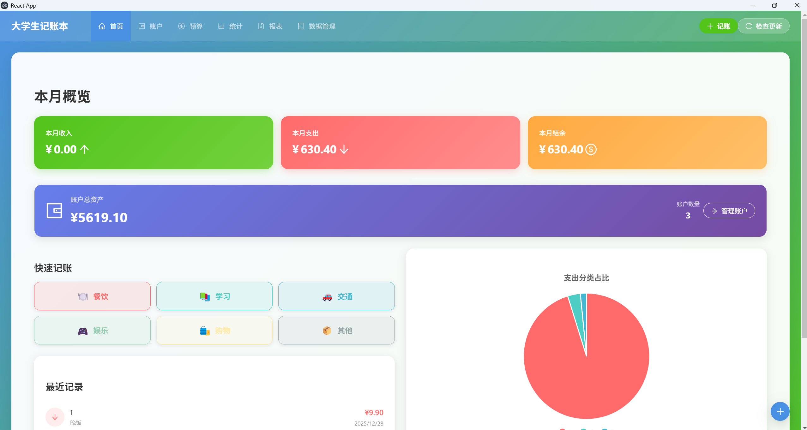
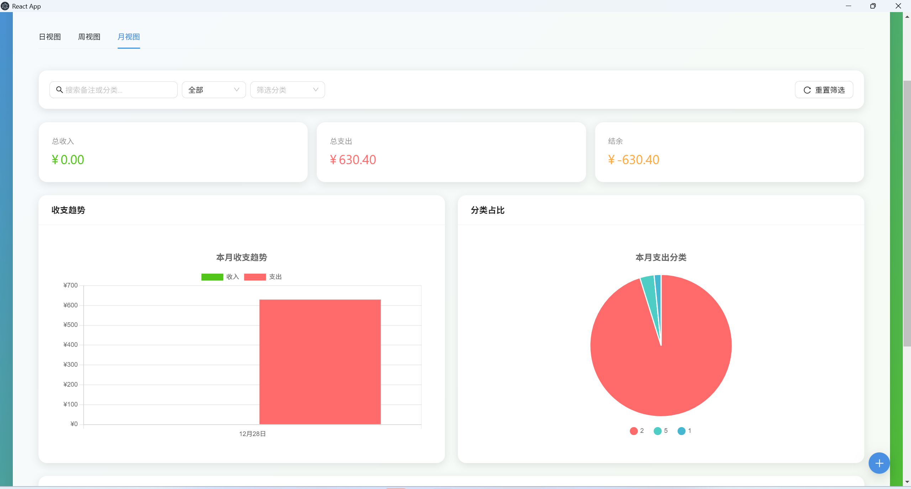
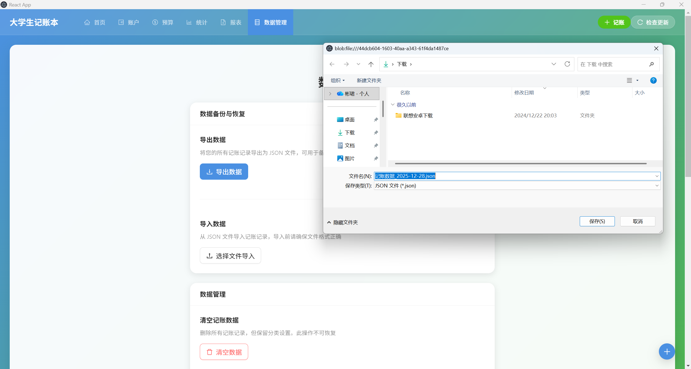

# 大学生记账本

<div align="center">

一款简洁、优雅的个人财务管理工具，专为大学生和年轻职场人士设计。

[](https://github.com/ALL2006/masyun-toolkit/releases)
[](LICENSE)
[](https://reactjs.org/)
[](https://www.electronjs.org/)

[功能特性](#功能特性) • [快速开始](#快速开始) • [使用指南](#使用指南) • [开发指南](#开发指南)

</div>

---

## ✨ 功能特性

### 核心功能

| 功能 | 描述 |
|------|------|
| 💰 **记账管理** | 快速记录收入和支出，支持多账户、多分类 |
| 📊 **数据统计** | 可视化图表展示收支趋势和分类占比 |
| 💳 **多账户** | 支持现金、银行卡、支付宝、微信等多种账户 |
| 📁 **分类管理** | 自定义收支分类，图标和颜色可配置 |
| 🎯 **预算管理** | 设置分类预算，实时监控消费进度 |
| 📄 **数据导出** | 支持导出 Excel 报表，方便数据分析 |
| 🔄 **账户转账** | 轻松记录账户间转账，资金流向清晰 |
| 💾 **数据备份** | 本地存储，支持数据导入导出 |

### 技术亮点

- **完全离线** - 基于 IndexedDB 本地存储，无需联网
- **自动更新** - 内置 electron-updater，自动检测和安装更新
- **跨平台** - 支持 Windows、macOS、Android
- **现代化 UI** - Ant Design 组件库，美观易用
- **类型安全** - TypeScript 开发，代码质量有保障

---

## 🚀 快速开始

### 方式一：下载安装包（推荐）

访问 [GitHub Releases](https://github.com/ALL2006/masyun-toolkit/releases) 下载最新版本：

- **Windows**: `finance-tracker-setup-x.x.x.exe`
- **macOS**: `大学生记账本-x.x.x.dmg` (即将推出)
- **Android**: `app-x.x.x.apk` (即将推出)

### 方式二：从源码运行

```bash
# 克隆仓库
git clone https://github.com/ALL2006/masyun-toolkit.git
cd masyun-toolkit/personal-finance-tracker

# 安装依赖
npm install

# 开发模式运行
npm run electron-dev

# 构建生产版本
npm run build
npm run dist
```

---

## 📖 使用指南

### 基础操作

1. **添加交易**
   - 点击右下角浮动按钮或使用快捷键
   - 选择账户、分类、金额、日期
   - 添加备注信息

2. **查看统计**
   - 首页展示本月收支概览
   - 统计页面查看详细图表分析

3. **管理账户**
   - 支持添加现金、银行卡、第三方支付账户
   - 可设置初始余额和账户类型

4. **设置预算**
   - 为每个分类设置月度预算
   - 实时查看预算使用进度

### 数据管理

- **导出数据**: 数据管理 → 导出 → 选择格式
- **导入数据**: 数据管理 → 导入 → 选择文件
- **清空数据**: 数据管理 → 清空（谨慎操作）

---

## 🛠️ 开发指南

### 技术栈

```
前端：React 19 + TypeScript 4.9 + Ant Design 6
桌面端：Electron 33 + electron-updater
数据：Dexie 4.2 (IndexedDB)
图表：Chart.js 4.5
构建：electron-builder 25
```

### 项目结构

```
personal-finance-tracker/
├── public/
│   └── electron.js          # Electron 主进程
├── src/
│   ├── components/          # React 组件
│   ├── pages/               # 页面组件
│   ├── services/            # 业务逻辑服务
│   ├── db/                  # 数据库配置
│   ├── types/               # TypeScript 类型
│   └── utils/               # 工具函数
├── package.json
└── README.md
```

### 开发命令

| 命令 | 说明 |
|------|------|
| `npm start` | 启动 React 开发服务器 |
| `npm run electron-dev` | 启动 Electron 开发模式 |
| `npm run build` | 构建 React 生产版本 |
| `npm run dist` | 打包 Electron 应用 |
| `npm test` | 运行测试 |

### 详细文档

- [开发指南](DEVELOPMENT_GUIDE.md) - 开发问题和解决方案
- [发布流程](RELEASE_WORKFLOW.md) - 版本发布完整流程
- [Android 指南](ANDROID_GUIDE.md) - Android 开发和打包

---

## 📸 应用截图

### 首页 - 财务概览


### 统计分析


### 账户管理


### 数据管理


---

## 🤝 贡献指南

欢迎贡献代码、报告问题或提出建议！

1. Fork 本仓库
2. 创建特性分支 (`git checkout -b feature/AmazingFeature`)
3. 提交更改 (`git commit -m 'Add some AmazingFeature'`)
4. 推送到分支 (`git push origin feature/AmazingFeature`)
5. 提交 Pull Request

### 开发规范

- 遵循 ESLint 规则
- 使用 TypeScript 类型注解
- 编写清晰的提交信息
- 更新相关文档

---

## 📝 更新日志

### [0.2.0] - 2025-12-28

#### 新增
- 添加预算管理功能
- 添加账户转账功能
- 添加数据导出功能
- 实现自动更新机制

#### 优化
- 修复白屏问题（路径解析）
- 修复自动更新文件名问题
- 优化 UI 交互体验

---

## 🔐 隐私说明

- 所有数据存储在本地浏览器 IndexedDB 中
- 不收集任何个人信息
- 不向任何第三方服务器发送数据
- 完全离线可用

---

## 📄 开源协议

本项目采用 [MIT License](LICENSE) 开源协议。

---

## 🙏 致谢

- [React](https://reactjs.org/)
- [Electron](https://www.electronjs.org/)
- [Ant Design](https://ant.design/)
- [Dexie.js](https://dexie.org/)
- [Chart.js](https://www.chartjs.org/)

---

<div align="center">

**如果觉得有用，请给一个 ⭐ Star 支持一下！**

Made with ❤️ by [ALL2006](https://github.com/ALL2006)

</div>
