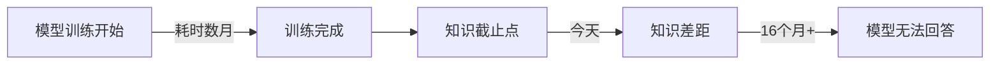
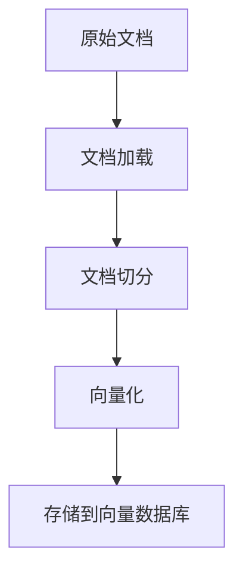
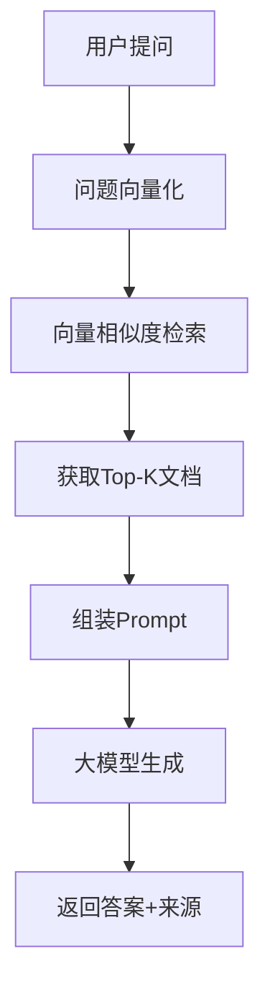

# RAG核心技术原理深度解析

> 作者：码上云开工
> 视频讲解：短视频平台账号「架构狮与橘」
> 阅读时间：约15分钟
> 难度级别：⭐⭐⭐

## 目录

- [一、什么是RAG](#一什么是rag)
- [二、为什么需要RAG](#二为什么需要rag)
- [三、RAG vs Fine-tuning](#三rag-vs-fine-tuning)
- [四、RAG完整工作流程](#四rag完整工作流程)
- [五、RAG技术栈全景](#五rag技术栈全景)
- [六、典型应用场景](#六典型应用场景)
- [七、挑战与解决方案](#七挑战与解决方案)
- [八、技术演进趋势](#八技术演进趋势)
- [九、总结](#九总结)

---

## 一、什么是RAG

### 1.1 核心概念

**RAG**（Retrieval-Augmented Generation，检索增强生成）是一种让大语言模型（LLM）能够连接外部知识库的技术架构。它的核心思想是：**在生成答案之前，先从外部知识库中检索相关资料，然后基于这些资料生成回答**。

### 1.2 名字解读

RAG这个名称完美概括了其三个核心步骤：

| 步骤 | 英文 | 中文 | 说明 |
|------|------|------|------|
| **R**etrieval | 检索 | 找资料 | 从知识库中找到相关文档 |
| **A**ugmented | 增强 | 补充上下文 | 将检索到的资料补充到问题中 |
| **G**eneration | 生成 | 产答案 | 基于增强后的上下文生成最终答案 |

### 1.3 一句话理解

> **RAG = 遇到问题先查书，查完再回答**

### 1.4 技术定位

```
┌─────────────────────────────────────────────────────┐
│                   大语言模型                          │
│                                                      │
│  ┌──────────┐    ┌──────────┐    ┌──────────┐      │
│  │ 纯LLM    │    │ Fine-tuning │   │   RAG    │      │
│  │          │    │          │    │          │      │
│  │ 通用知识  │    │ 特定任务  │    │ 外挂知识库 │      │
│  └──────────┘    └──────────┘    └──────────┘      │
│                                                      │
└─────────────────────────────────────────────────────┘
```

RAG不是要替代大模型或微调技术，而是作为一种**互补方案**，弥补大模型在知识时效性、专业领域准确性等方面的不足。

---

## 二、为什么需要RAG

### 2.1 大模型的四大痛点

#### 痛点1：知识时效性

大模型的训练数据有明确的截止日期，一旦训练完成，就无法获取新的知识。



**数据示例：**
- GPT-4训练数据截止：2023年9月
- Claude-3训练数据截止：2024年初
- 即使是最新的模型，也有数月的知识空白

#### 痛点2：专业领域知识不足

通用大模型虽然在广泛知识上表现优异，但在特定专业领域（医疗、法律、金融、企业内部知识）往往表现不佳。

| 场景 | 通用大模型 | RAG系统 |
|------|-----------|---------|
| 通用问答 | ✅ 优秀 | ✅ 优秀 |
| 企业制度 | ❌ 不知道 | ✅ 基于内部文档 |
| 医疗诊断 | ⚠️ 泛泛而谈 | ✅ 引用医学文献 |
| 法律咨询 | ❌ 缺乏法规细节 | ✅ 基于法律法规库 |

#### 痛点3：幻觉问题

大模型有时会"一本正经地胡说八道"，这就是所谓的"幻觉"（Hallucination）问题。

**幻觉产生原因：**
- 模型基于概率预测下一个词，而非事实检索
- 训练数据中的错误信息被模型学习
- 缺乏对生成内容的事实验证机制

**RAG的解决方案：**
```
传统LLM：问题 → 概率预测 → 可能错误的答案
RAG系统：问题 → 检索真实资料 → 基于资料生成 → 可追溯的答案
```

#### 痛点4：数据隐私与安全

很多企业不能将内部数据交给OpenAI、Anthropic等第三方公司进行模型训练。

**RAG的优势：**
- 企业内部部署，数据不出域
- 敏感信息可以加密存储
- 细粒度的权限控制

### 2.2 传统方案的局限性

| 方案 | 优点 | 缺点 | 成本 |
|------|------|------|------|
| **纯大模型** | 理解能力强 | 知识过时、易幻觉 | API调用费用 |
| **搜索引擎** | 信息全、实时 | 无法理解语义，需人工筛选 | 开发成本低 |
| **知识图谱** | 结构化强 | 构建成本极高 | 构建成本高 |
| **Fine-tuning** | 特定任务优化 | 更新成本高，可能遗忘 | 训练成本高 |
| **RAG** | 实时更新、可追溯 | 需要搭建系统 | 中等成本 |

### 2.3 RAG的核心价值

```
┌─────────────────────────────────────────────┐
│              RAG的核心价值                    │
├─────────────────────────────────────────────┤
│  ✓ 知识实时更新（秒级 vs 月级）               │
│  ✓ 专业领域准确（引用权威资料）               │
│  ✓ 减少幻觉（基于真实文档生成）               │
│  ✓ 可追溯性（标注答案来源）                   │
│  ✓ 数据隐私（企业内部部署）                   │
│  ✓ 成本可控（无需重新训练模型）               │
└─────────────────────────────────────────────┘
```

---

## 三、RAG vs Fine-tuning

这是最常被问到的问题：为什么不直接微调模型，而要用RAG？

### 3.1 核心区别

我们可以用一个类比来理解：

| 方案 | 类比 | 特点 |
|------|------|------|
| **RAG** | 考试时允许翻书 | 需要什么查什么，灵活但依赖检索质量 |
| **Fine-tuning** | 考前去补习班强化 | 把知识记在脑子里，但更新成本高 |

### 3.2 详细对比表

| 对比维度 | RAG | Fine-tuning |
|---------|-----|-------------|
| **知识更新** | ✅ 实时更新，秒级生效 | ❌ 需要重新训练，耗时数周 |
| **实施成本** | ✅ 低（几万元搭建） | ❌ 高（几十万+训练成本） |
| **数据需求** | ✅ 只需要文档（易获取） | ❌ 需要大量高质量问答对 |
| **可解释性** | ✅ 高（能追溯答案来源） | ❌ 低（黑盒模型） |
| **知识截止** | ✅ 无截止日期 | ❌ 训练完成后知识固定 |
| **适用场景** | 知识密集型问答 | 特定任务/格式调整 |
| **幻觉风险** | ⚠️ 低（基于真实资料） | ⚠️ 中（可能编造） |
| **维护难度** | ⚠️ 中（需维护知识库） | ⚠️ 低（训练完不用管） |
| **性能上限** | ⚠️ 受限于检索质量 | ✅ 可以更深层次学习 |

### 3.3 如何选择？

#### 选择RAG的场景

✅ 知识频繁更新（新闻、法规、产品文档）
✅ 要求答案可追溯（医疗、法律、金融）
✅ 数据量不大但质量高（企业内部文档）
✅ 需要快速上线（几周内）
✅ 预算有限（几万级别）

#### 选择Fine-tuning的场景

✅ 需要特定输出格式（代码、结构化数据）
✅ 需要特定语言风格（客服话术、品牌调性）
✅ 有大量高质量训练数据（万级问答对）
✅ 任务相对稳定（不频繁变化）
✅ 预算充足（几十万+）

### 3.4 最佳实践：组合使用

实际上，**RAG和Fine-tuning不是非此即彼的关系**，很多企业会将两者结合：

```
┌──────────────────────────────────────┐
│          RAG + Fine-tuning            │
├──────────────────────────────────────┤
│  Step 1: 用RAG获取知识（解决"知道什么"）│
│  Step 2: 用Fine-tuning调整风格（"怎么   │
│          说"）                         │
│                                        │
│  示例：企业智能客服                    │
│  - RAG: 产品知识库（实时更新）          │
│  - FT: 客服话术风格（品牌调性）         │
└──────────────────────────────────────┘
```

**组合使用的优势：**
- 既有实时知识的准确性
- 又有符合品牌调性的表达方式
- 兼顾知识更新和风格定制

---

## 四、RAG完整工作流程

RAG的工作流程可以分为两个阶段：**索引阶段**（准备阶段）和**查询阶段**（使用阶段）。

### 4.1 索引阶段

索引阶段的目标是将原始文档转化为可检索的向量表示。



#### Step 1: 文档加载（Document Loading）

**支持格式：**
- 文本文件：TXT, MD, CSV
- 办公文档：PDF, Word, Excel, PPT
- 网页内容：HTML, Markdown
- 结构化数据：JSON, XML, Database
- 其他：图片（OCR）、音频（ASR）

**主流工具：**
- LangChain loaders（100+种加载器）
- LlamaIndex readers
- Unstructured（通用文档解析）

#### Step 2: 文档切分（Chunking）

**为什么需要切分？**
- 大模型有上下文窗口限制
- 细粒度检索更精准
- 便于更新和维护

**切分策略对比：**

| 策略 | 说明 | 优点 | 缺点 | 适用场景 |
|------|------|------|------|---------|
| **固定长度切分** | 按字符数切分 | 简单高效 | 可能截断语义 | 通用文档 |
| **语义切分** | 按段落/章节 | 保持语义完整 | 实现复杂 | 结构化文档 |
| **递归切分** | 多级切分 | 平衡大小和语义 | 需要调参 | 混合文档 |
| **专用切分** | 针对代码/表格 | 保留结构 | 适用性窄 | 特殊格式 |

**经验参数：**
```python
# 推荐配置
chunk_size = 500-1000        # 每块大小
chunk_overlap = 50-200       # 重叠大小
separators = ["\n\n", "\n", "。", "，", " "]  # 切分分隔符
```

#### Step 3: 向量化（Embedding）

这是RAG的核心技术：将文本转换为数学向量。

**什么是向量？**
```
文本："苹果是一种水果"
     ↓ Embedding模型
向量：[0.23, -0.56, 0.78, ..., 0.12]  // 1536维
```

**为什么要向量化？**
因为向量可以计算**语义相似度**！

```
相似度计算示例：

问题向量  ·  文档向量1  = 0.95  ← 高度相关
问题向量  ·  文档向量2  = 0.32  ← 不相关
问题向量  ·  文档向量3  = 0.78  ← 比较相关
```

**主流嵌入模型：**

| 模型 | 维度 | 语言 | 推荐场景 | 评分 |
|------|------|------|---------|------|
| **OpenAI Embedding-3** | 1536/3072 | 多语言 | 商业应用 | ⭐⭐⭐⭐⭐ |
| **BGE-large-zh** | 1024 | 中文 | 中文场景 | ⭐⭐⭐⭐⭐ |
| **m3e-base** | 768 | 中文 | 轻量级中文 | ⭐⭐⭐⭐ |
| **Cohere Embed** | 1024 | 多语言 | 多语言混合 | ⭐⭐⭐⭐ |
| **Voyage AI** | 1024 | 多语言 | 高精度检索 | ⭐⭐⭐⭐ |

#### Step 4: 存储到向量数据库

向量数据库是专门用于存储和检索高维向量的数据库。

**向量数据库 vs 传统数据库：**

| 特性 | 传统数据库 | 向量数据库 |
|------|-----------|-----------|
| 数据类型 | 结构化数据 | 高维向量 |
| 查询方式 | 精确匹配 | 相似度搜索 |
| 索引技术 | B-Tree, Hash | HNSW, IVF, PQ |
| 查询复杂度 | O(log n) | O(log n) |
| 扩展性 | 垂直扩展 | 水平扩展 |
| 代表产品 | MySQL, PostgreSQL | Milvus, Pinecone |

**主流向量数据库对比：**

| 数据库 | 类型 | 优点 | 缺点 | 推荐指数 |
|--------|------|------|------|---------|
| **Milvus** | 开源 | 功能全、性能好 | 部署复杂 | ⭐⭐⭐⭐⭐ |
| **Pinecone** | 商业 | 易用、托管 | 价格高 | ⭐⭐⭐⭐⭐ |
| **Weaviate** | 开源 | 易集成、GraphQL | 性能一般 | ⭐⭐⭐⭐ |
| **Qdrant** | 开源 | 性能好、Rust写 | 生态较小 | ⭐⭐⭐⭐ |
| **Chroma** | 开源 | 极简、易用 | 功能简单 | ⭐⭐⭐ |

### 4.2 查询阶段

查询阶段是用户实际使用RAG系统的过程。



#### Step 1: 问题向量化

用户的问题需要使用与索引阶段**相同的嵌入模型**进行向量化。

```python
# 伪代码示例
question = "公司的年假制度是怎样的？"
question_vector = embedding_model.encode(question)
# 输出：[0.45, 0.23, -0.67, ..., 0.89]
```

#### Step 2: 向量相似度检索

系统在向量数据库中搜索与问题向量最相似的文档。

**相似度计算方法：**

| 方法 | 公式 | 说明 | 推荐场景 |
|------|------|------|---------|
| **余弦相似度** | cos(θ) = A·B / (\|A\|\|B\|) | 关注方向，不关注大小 | 最常用 |
| **欧氏距离** | d = √Σ(ai-bi)² | 关注绝对距离 | 特定场景 |
| **点积** | A·B = Σai·bi | 计算简单，需归一化 | 高性能场景 |

**Top-K检索：**
- K值选择：3-10（太少信息不足，太多噪声增加）
- 相似度阈值：0.7-0.85（低于阈值的结果不采用）

#### Step 3: 组装Prompt

这是RAG的关键步骤：将检索到的文档与用户问题组合成完整的Prompt。

**Prompt模板示例：**
```
【系统角色】
你是一个专业的客服助手，请根据以下参考资料回答用户问题。

【参考资料】
资料1（相关度95%）：
员工手册第3章第2条规定：入职满1年享有5天年假，
满3年享有10天年假，满5年享有15天年假。

资料2（相关度78%）：
2024年最新休假制度补充说明：年假可以跨年使用，
但需在次年3月前提出申请。

资料3（相关度32%）：
产品技术文档...（此内容与问题无关，请忽略）

【用户问题】
公司年假怎么算？是否有时间限制？

【回答要求】
1. 只根据提供的资料回答，不要编造
2. 如果资料中没有答案，请明确告知
3. 引用具体的资料来源
4. 回答要简洁明了，重点突出
```

#### Step 4: 大模型生成

大模型基于这个增强后的Prompt生成最终答案。

**生成过程：**
```
Input: [上述Prompt]
       ↓
LLM: GPT-4 / Claude / GLM
       ↓
Output: 根据员工手册第3章第2条，公司年假规定如下：
       - 入职满1年：5天年假
       - 入职满3年：10天年假
       - 入职满5年：15天年假

       年假可以跨年使用，但需在次年3月前提出申请。

       来源：员工手册第3章第2条、2024年休假制度补充说明
```

#### Step 5: 返回答案

最终的答案包含：
1. 生成的回答内容
2. 引用的资料来源
3. 可选：相似度分数

### 4.3 完整示例

**用户问题：** "公司的年假制度是怎样的？"

**处理流程：**

```
1. 问题向量化
   "公司的年假制度是怎样的？"
   → [0.45, 0.23, -0.67, ...]

2. 向量检索
   ┌────────────────────────────────────┐
   │ 向量数据库                          │
   ├────────────────────────────────────┤
   │ Doc1: [员工手册...] 相似度: 0.95 ✓ │
   │ Doc2: [休假制度...] 相似度: 0.78 ✓ │
   │ Doc3: [产品文档...] 相似度: 0.32 ✗ │
   └────────────────────────────────────┘

3. 选择Top-2文档
   - Doc1 (相似度95%)
   - Doc2 (相似度78%)

4. 组装Prompt
   [系统提示] + [Doc1内容] + [Doc2内容] + [用户问题]

5. LLM生成
   "根据员工手册第3章第2条..."

6. 返回结果
   答案 + 来源
```

---

## 五、RAG技术栈全景

一个完整的RAG系统涉及多个层面的技术选型。

### 5.1 技术栈分层架构

```
┌─────────────────────────────────────────────────┐
│                   应用层                         │
│    智能客服  |  企业知识库  |  文档问答  |  代码助手  │
├─────────────────────────────────────────────────┤
│                  RAG引擎层                       │
│  ┌──────────┐ ┌──────────┐ ┌──────────┐        │
│  │ 文档加载  │ │  文档切分 │ │  向量化   │        │
│  └──────────┘ └──────────┘ └──────────┘        │
│  ┌──────────┐ ┌──────────┐ ┌──────────┐        │
│  │  向量检索 │ │  重排序   │ │  答案生成 │        │
│  └──────────┘ └──────────┘ └──────────┘        │
├─────────────────────────────────────────────────┤
│                   存储层                         │
│  ┌──────────────────┐  ┌─────────────────┐     │
│  │   向量数据库       │  │   文档数据库      │     │
│  │ Milvus/Pinecone  │  │  PostgreSQL     │     │
│  └──────────────────┘  └─────────────────┘     │
├─────────────────────────────────────────────────┤
│                   模型层                         │
│  ┌──────────────────┐  ┌─────────────────┐     │
│  │   嵌入模型        │  │   生成模型       │     │
│  │ BGE/OpenAI Embed │  │ GPT-4/Claude    │     │
│  └──────────────────┘  └─────────────────┘     │
├─────────────────────────────────────────────────┤
│                   基础设施层                     │
│  ┌──────────────────┐  ┌─────────────────┐     │
│  │   计算资源        │  │   存储资源       │     │
│  │ GPU/CPU          │  │ SSD/HDD         │     │
│  └──────────────────┘  └─────────────────┘     │
└─────────────────────────────────────────────────┘
```

### 5.2 核心组件技术选型

#### RAG框架

| 框架 | 语言 | 特点 | 学习曲线 | 推荐指数 |
|------|------|------|---------|---------|
| **LangChain** | Python/JS | 生态最丰富，功能全面 | 中等 | ⭐⭐⭐⭐⭐ |
| **LlamaIndex** | Python/JS | 专注RAG，数据连接强 | 中等 | ⭐⭐⭐⭐⭐ |
| **Haystack** | Python | 深度定制，企业级 | 陡峭 | ⭐⭐⭐⭐ |
| **Semantic Kernel** | Python/C# | 微软出品，Azure集成 | 中等 | ⭐⭐⭐⭐ |

#### 向量数据库

| 数据库 | 类型 | 部署难度 | 性能 | 成本 | 推荐场景 |
|--------|------|---------|------|------|---------|
| **Milvus** | 开源 | ⭐⭐⭐⭐ | ⭐⭐⭐⭐⭐ | 低 | 企业自建 |
| **Pinecone** | 商业 | ⭐ | ⭐⭐⭐⭐⭐ | 高 | 快速验证 |
| **Weaviate** | 开源 | ⭐⭐⭐ | ⭐⭐⭐⭐ | 低 | 快速集成 |
| **Qdrant** | 开源 | ⭐⭐⭐ | ⭐⭐⭐⭐⭐ | 低 | 高性能需求 |
| **Chroma** | 开源 | ⭐ | ⭐⭐⭐ | 低 | 快速原型 |

#### 嵌入模型

| 模型 | 维度 | 中文支持 | 性能 | 成本 | 推荐场景 |
|------|------|---------|------|------|---------|
| **OpenAI Embedding-3** | 1536/3072 | ⭐⭐⭐⭐ | ⭐⭐⭐⭐⭐ | 按量付费 | 商业应用 |
| **BGE-large-zh-v1.5** | 1024 | ⭐⭐⭐⭐⭐ | ⭐⭐⭐⭐⭐ | 免费 | 中文主力 |
| **m3e-large** | 1024 | ⭐⭐⭐⭐⭐ | ⭐⭐⭐⭐ | 免费 | 中文轻量 |
| **Cohere Embed v3** | 1024 | ⭐⭐⭐⭐ | ⭐⭐⭐⭐⭐ | 按量付费 | 多语言 |
| **Jina Embeddings** | 768 | ⭐⭐⭐ | ⭐⭐⭐⭐ | 免费/付费 | 通用 |

#### 生成模型

| 模型 | 上下文窗口 | 中文能力 | 推理能力 | 成本 | 推荐场景 |
|------|-----------|---------|---------|------|---------|
| **GPT-4o** | 128K | ⭐⭐⭐⭐ | ⭐⭐⭐⭐⭐ | 中高 | 复杂推理 |
| **Claude 3.5 Sonnet** | 200K | ⭐⭐⭐⭐ | ⭐⭐⭐⭐⭐ | 中等 | 长文档 |
| **GLM-4** | 128K | ⭐⭐⭐⭐⭐ | ⭐⭐⭐⭐ | 中等 | 中文主力 |
| **Qwen2.5** | 32K | ⭐⭐⭐⭐⭐ | ⭐⭐⭐⭐ | 低 | 开源方案 |
| **DeepSeek-V3** | 64K | ⭐⭐⭐⭐⭐ | ⭐⭐⭐⭐ | 极低 | 成本敏感 |

### 5.3 推荐技术栈组合

#### 组合1：快速验证（适合初学者）

```
LangChain + Chroma + OpenAI Embedding + GPT-4o
```
- 优点：快速搭建，文档丰富
- 缺点：API调用成本
- 适用：POC验证、小规模应用

#### 组合2：中文主力（性价比高）

```
LlamaIndex + Milvus + BGE-large-zh + GLM-4
```
- 优点：中文效果好，成本可控
- 缺点：需要自建向量库
- 适用：中文企业应用

#### 组合3：高性能企业级（大规模）

```
LangChain + Milvus集群 + BGE-m3 + Claude/GPT-4o
```
- 优点：性能优秀，扩展性强
- 缺点：部署复杂度高
- 适用：百万级用户规模

#### 组合4：极致成本优化（预算有限）

```
LangChain + Qdrant + m3e + Qwen2.5
```
- 优点：成本最低，可本地部署
- 缺点：性能略降
- 适用：小团队、内部工具

---

## 六、典型应用场景

### 6.1 企业知识库

**痛点：**
- 公司文档分散在各个系统
- 新员工找不到资料，只能问人
- 知识随着人员流动而流失

**RAG解决方案：**
```
┌──────────────────────────────────────┐
│          企业知识库系统                │
├──────────────────────────────────────┤
│  数据源：                            │
│  - 员工手册                          │
│  - 技术文档                          │
│  - 会议记录                          │
│  - 培训材料                          │
│  - 邮件往来                          │
│                                      │
│  核心功能：                          │
│  - 自然语言提问                      │
│  - 智能检索匹配                      │
│  - 答案带来源                        │
│  - 权限控制                          │
└──────────────────────────────────────┘
```

**效果对比：**

| 查找方式 | 耗时 | 准确率 | 满意度 |
|---------|------|--------|--------|
| 人工查找（问同事） | 30分钟 | 60% | ⭐⭐ |
| 关键词搜索 | 10分钟 | 70% | ⭐⭐⭐ |
| RAG智能问答 | 1分钟 | 85% | ⭐⭐⭐⭐⭐ |

**ROI分析：**
- 员工时薪：50元/小时
- 每天节省：29分钟 × 50元 ÷ 60 = 24元/人/天
- 百人公司年节省：24 × 100 × 250工作日 = 60万元/年
- 系统建设成本：5-10万元
- 回本周期：1-2个月

### 6.2 智能客服

**痛点：**
- 人工客服成本高（5000元/月/人）
- 24小时服务需要三班倒
- 培训周期长，流动性大

**RAG解决方案：**
```
用户问题
   ↓
意图识别
   ↓
RAG检索产品知识库
   ↓
生成专业回答
   ↓
返回答案（含产品链接）
```

**成本对比：**

| 项目 | 人工客服（10人） | RAG系统 |
|------|----------------|---------|
| 月人力成本 | 5万元 | 0元 |
| 系统建设成本 | 0元 | 2万元（一次性） |
| 月运维成本 | 0元 | 3000元 |
| 年总成本 | 60万元 | 5.6万元 |
| 年节省 | - | 54.4万元 |

**服务能力对比：**

| 指标 | 人工客服 | RAG客服 |
|------|---------|---------|
| 服务时间 | 8小时/天 | 24小时/天 |
| 并发能力 | 1人/10次 | 1000+次/秒 |
| 响应时间 | 1-5分钟 | 1-3秒 |
| 知识更新 | 需培训 | 秒级更新 |
| 情绪稳定 | ❌ | ✅ |

### 6.3 法律/医疗咨询

**特点：**
- 专业性极强，不能出错
- 需要引用权威资料
- 答案可追溯

**RAG优势：**
```
┌──────────────────────────────────────┐
│         专业领域RAG系统                │
├──────────────────────────────────────┤
│  数据源：                            │
│  - 法律法规库（法律）                 │
│  - 医学文献库（医疗）                 │
│  - 权威指南                           │
│  - 专家经验                           │
│                                      │
│  特殊设计：                          │
│  - 高精度检索（0.9+相似度）           │
│  - 强制引用来源                       │
│  - 风险提示机制                       │
│  - 人工审核流程                       │
└──────────────────────────────────────┘
```

**应用示例：**

**医疗场景：**
```
问：高血压患者应该注意什么？

答：根据《中国高血压防治指南2024版》：
1. 低盐饮食（每日<6g）
2. 规律运动（每周150分钟中等强度）
3. 规律服药，不可擅自停药
4. 定期监测血压

来源：中国高血压防治指南2024版 第3章

【重要提示】本回答仅供参考，具体诊疗请遵医嘱
```

### 6.4 代码助手

**场景：**
- 新员工理解公司代码库
- 快速查找相关代码示例
- 代码规范查询

**技术要点：**
- 代码特殊切分（按函数/类）
- 语法树分析
- 代码注释提取
- 版本控制集成

### 6.5 教育培训

**应用方向：**
- 课程资料智能问答
- 个性化学习路径
- 作业辅导（不直接给答案）
- 学习效果评估

**特色设计：**
- 知识图谱构建
- 学习进度追踪
- 错题关联分析
- 个性化推荐

---

## 七、挑战与解决方案

RAG虽然强大，但在实际应用中也面临诸多挑战。

### 7.1 检索准确率挑战

**问题：** 检索是RAG的第一步，如果检索错了，答案肯定错。

**影响检索准确率的因素：**

| 因素 | 说明 | 影响 |
|------|------|------|
| 文档切分质量 | 切分不当导致语义不完整 | ⭐⭐⭐⭐⭐ |
| 嵌入模型质量 | 模型语义理解能力 | ⭐⭐⭐⭐⭐ |
| 检索策略 | 单一检索vs混合检索 | ⭐⭐⭐⭐ |
| 查询表述 | 用户问题的清晰度 | ⭐⭐⭐ |

**解决方案：**

#### 方案1：优化文档切分
```python
# 推荐配置
chunk_config = {
    "chunk_size": 500-1000,      # 根据文档类型调整
    "chunk_overlap": 50-200,     # 保持上下文连贯
    "separators": ["\n\n", "\n", "。", "，", " "],
    "keep_sentence": True,       # 保持句子完整
}
```

#### 方案2：使用高质量嵌入模型
- 中文场景：BGE-large-zh-v1.5
- 多语言：OpenAI Embedding-3
- 定制：fine-tune通用模型

#### 方案3：混合检索
```
向量检索（语义）
     +
关键词检索（BM25）
     =
混合结果（更准确）
```

#### 方案4：重排序（Rerank）
```
Step 1: 粗排（向量检索Top-100）
   ↓
Step 2: 精排（Rerank模型重新打分）
   ↓
Step 3: 选择Top-5
```

**推荐Rerank模型：**
- BGE-reranker-large
- Cohere Rerank API
- ColBERT

### 7.2 上下文窗口限制

**问题：** 大模型一次能处理的文档长度有限。

**各模型上下文窗口对比：**

| 模型 | 上下文窗口 | 可容纳文档 | 成本 |
|------|-----------|-----------|------|
| GPT-3.5-turbo | 16K | 5-8篇 | 低 |
| GPT-4o | 128K | 30-50篇 | 高 |
| Claude 3.5 Sonnet | 200K | 50-80篇 | 中 |
| Kimi (月之暗面) | 2M | 500+篇 | 中 |
| GLM-4 | 128K | 30-50篇 | 中 |

**解决方案：**

#### 方案1：选择长窗口模型
- 超长文档：Kimi (2M)
- 性价比：Claude 3.5 Sonnet (200K)

#### 方案2：智能文档筛选
```
Top-50检索结果
   ↓
去重（相似内容合并）
   ↓
多样性选择（覆盖不同方面）
   ↓
Top-10精选
```

#### 方案3：分块处理
```
超大文档
   ↓
切分成多个部分
   ↓
分别处理
   ↓
答案合并
```

#### 方案4：摘要压缩
```
检索到的文档
   ↓
提取关键信息
   ↓
生成摘要
   ↓
使用摘要而非全文
```

### 7.3 实时性挑战

**问题：** 虽然比重新训练快，但索引更新仍有延迟。

**延迟来源：**
- 文档处理：1-10秒
- 向量化：1-5秒
- 索引更新：1-3秒
- 总延迟：3-18秒

**解决方案：**

#### 方案1：流式索引
```
文档到达 → 立即处理 → 增量更新索引
```

#### 方案2：热数据缓存
```
热数据（最近访问）
   ↓
内存缓存（Redis）
   ↓
毫秒级响应
```

#### 方案3：分层索引
```
L1: 实时索引（最近1小时数据）
L2: 小时索引（最近24小时数据）
L3: 日索引（历史数据）
```

### 7.4 多模态支持

**当前局限：**
- 大部分RAG系统只支持文本
- 图像、表格检索能力弱

**解决方案：**

#### 方案1：多模态嵌入模型
```
CLIP模型：
- 图像 + 文本联合嵌入
- 支持图文跨模态检索
```

#### 方案2：专用表格处理
```
表格
   ↓
提取为Markdown/HTML
   ↓
文本化处理
   ↓
传统RAG流程
```

#### 方案3：OCR + 视觉模型
```
图像
   ↓
OCR识别 → 文字
   ↓
视觉模型理解 → 描述
   ↓
文本RAG处理
```

### 7.5 成本优化

**成本构成：**

| 组件 | 成本类型 | 优化方向 |
|------|---------|---------|
| 向量数据库 | 基础设施 | 开源替代 |
| 嵌入模型 | API调用 | 本地部署 |
| 生成模型 | API调用 | 混合使用 |
| 存储资源 | 磁盘空间 | 定期清理 |

**优化策略：**

#### 策略1：混合部署
```
核心业务（GPT-4）  ← 10%流量
一般业务（GLM-4）  ← 60%流量
简单任务（Qwen）   ← 30%流量
```

#### 策略2：缓存机制
```
相似问题
   ↓
命中缓存
   ↓
直接返回（0元）
```

#### 策略3：本地部署
```
开源方案：
- 嵌入：BGE（免费）
- 生成：Qwen/GLM（免费/低成本）
- 向量库：Milvus（免费）
```

**成本参考（月查询100万次）：**

| 方案 | 月成本 |
|------|--------|
| 全商业（OpenAI） | 8000-12000元 |
| 混合（部分本地） | 3000-5000元 |
| 全开源（本地部署） | 1000-2000元（服务器成本） |

---

## 八、技术演进趋势

### 8.1 发展历程

```
2020年
├── Facebook提出RAG概念
└── 开创检索增强生成新范式

2021年
├── 向量数据库兴起（Pinecone成立）
└── RAG基础设施逐步完善

2022年
├── ChatGPT爆发，AI进入大众视野
└── RAG成为企业AI应用首选方案

2023年
├── 开源生态成熟（LangChain、LlamaIndex）
└── RAG开发门槛大幅降低

2024年
├── 企业级RAG应用大规模落地
└── 行业解决方案成熟

2025年（预测）
├── Agentic RAG（AI自主检索）
└── 多模态RAG普及
```

### 8.2 未来趋势

#### 趋势1：Agentic RAG

**当前RAG：** 固定的检索流程
**Agentic RAG：** AI自主决定检索策略

```
问题："分析2024年Q4财务数据"

当前RAG：
1. 固定检索3篇文档
2. 生成答案

Agentic RAG：
1. AI分析：需要财务报表、行业对比、历史数据
2. 自主决定检索策略
3. 分步获取数据
4. 综合分析生成答案
5. 补充检索（如果需要）
```

**代表项目：**
- AutoRAG
- Agentic RAG（LangGraph）
- Self-RAG

#### 趋势2：多模态RAG

**从文本扩展到多模态：**

| 模态 | 技术进展 | 应用场景 |
|------|---------|---------|
| **文本** | 成熟 | 通用问答 |
| **图像** | 快速发展 | 医疗影像、产品图片检索 |
| **视频** | 早期阶段 | 视频内容问答 |
| **音频** | 早期阶段 | 语音客服、会议记录 |
| **表格** | 发展中 | 财报分析、数据查询 |

**技术方案：**
- CLIP（图文联合嵌入）
- ColPali（视觉文档检索）
- LLaVA（多模态理解）

#### 趋势3：实时RAG

**目标：** 毫秒级索引更新

**技术方向：**
- 流式索引架构
- 增量向量更新
- 边缘计算支持

**应用场景：**
- 实时新闻问答
- 社交媒体监控
- 股票市场分析

#### 趋势4：边缘RAG

**需求：** 数据不出设备

**技术方案：**
- 轻量级嵌入模型（MobileBERT）
- 本地向量数据库（SQLite-VSS）
- 边缘AI芯片（NPU/GPU）

**应用场景：**
- 移动端智能助手
- 离线知识库
- 隐私敏感应用

#### 趋势5：RAG评测体系

**当前问题：** 缺乏统一的RAG评测标准

**发展方向：**
- RAGAS（RAG Assessment框架）
- TruLens（RAG可观测性）
- ARES（RAG评测基准）

**评测维度：**
```
RAG质量
├── 检索质量（Recall@K, Precision@K）
├── 生成质量（Faithfulness, Answer Relevancy）
├── 端到端质量（用户满意度）
└── 性能指标（延迟、吞吐量）
```

---

## 九、总结

### 9.1 核心要点

1. **RAG定义：** 检索增强生成 = 检索 + 增强 + 生成
   - 本质：给大模型装上"外挂知识库"
   - 目标：解决大模型知识过时、专业性不足、幻觉问题

2. **RAG vs Fine-tuning：**
   - RAG：知识实时更新、成本较低、可追溯
   - Fine-tuning：深度学习、风格定制、成本较高
   - 最佳实践：组合使用

3. **工作流程：**
   - 索引阶段：文档加载 → 切分 → 向量化 → 存储
   - 查询阶段：问题向量化 → 检索 → 组装Prompt → 生成 → 返回

4. **技术栈：**
   - 框架：LangChain / LlamaIndex
   - 向量库：Milvus / Pinecone
   - 嵌入：BGE / OpenAI Embedding
   - 生成：GPT-4 / Claude / GLM

5. **应用场景：**
   - 企业知识库（效率提升）
   - 智能客服（成本降低）
   - 专业咨询（准确可靠）
   - 代码助手（开发提效）

### 9.2 关键指标

| 指标 | 目标值 | 说明 |
|------|--------|------|
| **检索准确率** | >85% | Top-5相关度 |
| **答案准确率** | >80% | 端到端评测 |
| **响应延迟** | <3秒 | 端到端时间 |
| **知识更新延迟** | <1分钟 | 索引更新时间 |
| **成本/千次查询** | 5-50元 | 根据方案不同 |

### 9.3 快速上手建议

**对于初学者：**
1. 从LangChain + Chroma + OpenAI开始
2. 用自己的文档搭建第一个RAG
3. 理解完整流程后再优化

**对于企业应用：**
1. 明确业务场景和需求
2. 选择合适的技术栈组合
3. 小规模验证效果
4. 逐步优化和扩展

### 9.4 学习路径

```
第一阶段：理解原理（本文）
   ↓
第二阶段：向量数据库（下一期）
   ↓
第三阶段：检索优化
   ↓
第四阶段：质量评估
   ↓
第五阶段：企业实战
```

### 9.5 下期预告

**《向量数据库深度解析》** 将涵盖：
- 向量的数学原理
- 相似度计算方法
- 主流向量数据库深度对比
- 实战搭建生产级向量库
- 性能优化技巧

---

## 参考资源

### 论文
- Retrieval-Augmented Generation for Knowledge-Intensive NLP Tasks (Lewis et al., 2020)
- LATM: Language Model Transformations for Retrieval (2023)

### 开源项目
- LangChain: https://github.com/langchain-ai/langchain
- LlamaIndex: https://github.com/run-llama/llama_index
- Milvus: https://github.com/milvus-io/milvus

### 学习资源
- RAG实战教程：Pinecone Learning Center
- 向量数据库指南：Weaviate Academy
- LangChain文档：https://python.langchain.com/

---

**版权声明：** 本文原创内容，转载请注明出处。

**作者：** 码上云开工
**发布时间：** 2025年1月
**系列：** RAG深度解析系列 第01期

---

> 💡 **互动提问：**
> - 你的企业是否面临知识管理难题？
> - 你对RAG的哪个方面最感兴趣？
> - 欢迎在评论区分享你的看法和问题！
