# 向量数据库深度解析：RAG系统的核心引擎

> 作者：码上云开工
> 视频讲解：短视频平台账号「架构狮与橘」
> 阅读时间：约20分钟
> 难度级别：⭐⭐⭐⭐

## 目录

- [一、什么是向量](#一什么是向量)
- [二、嵌入模型演进史](#二嵌入模型演进史)
- [三、相似度计算方法](#三相似度计算方法)
- [四、向量数据库vs传统数据库](#四向量数据库vs传统数据库)
- [五、ANN算法深度解析](#五ann算法深度解析)
- [六、主流向量数据库对比](#六主流向量数据库对比)
- [七、实战部署指南](#七实战部署指南)
- [八、性能优化策略](#八性能优化策略)
- [九、挑战与解决方案](#九挑战与解决方案)
- [十、未来发展趋势](#十未来发展趋势)
- [十一、总结](#十一总结)

---

## 一、什么是向量

### 1.1 数学定义

在数学中，**向量（Vector）**是一个**有序的数字列表**，也称为**数组**或**张量**。

```python
# 不同维度的向量
一维向量: [5]  # 标量
二维向量: [3, 4]
三维向量: [1, 2, 3]
高维向量: [0.23, -0.56, 0.78, ..., 0.12]  # 1536维
```

### 1.2 AI中的向量

在人工智能领域，**向量是信息的数学表示**。AI通过嵌入模型（Embedding Model）将各种信息（文字、图像、音频）转化为向量，从而让计算机能够理解和计算语义。

**核心洞察：**

```
语义相似的文本 → 在向量空间中距离更近
语义不同的文本 → 在向量空间中距离更远
```

**示例：**

```
"苹果"    → [0.23, -0.56, 0.78, ..., 0.12]
"水果"    → [0.25, -0.54, 0.76, ..., 0.15]
"汽车"    → [0.67, 0.23, -0.45, ..., 0.89]

计算距离：
|苹果 - 水果| = 0.08  ← 很近（语义相似）
|苹果 - 汽车| = 0.72  ← 很远（语义不同）
```

### 1.3 向量的维度

向量的维度决定了它能表达多少信息：

| 维度 | 说明 | 应用场景 |
|------|------|---------|
| **50-300维** | 早期词向量 | Word2Vec、GloVe |
| **768维** | BERT基础 | BERT-base、RoBERTa |
| **1024维** | BERT大型 | BERT-large、BGE |
| **1536维** | OpenAI最新 | OpenAI Embedding-3 |
| **3072维** | 超高精度 | OpenAI Embedding-3-large |

**经验法则：**
- 维度越高 → 表达能力越强 → 但计算和存储成本也越高
- 不是越大越好，需要权衡性能和成本

---

## 二、嵌入模型演进史

嵌入模型是向量生成的核心，经历了从静态到动态、从浅层到深层的演进。

### 2.1 时代划分

```mermaid
graph LR
    A[2013: Word2Vec] --> B[2014: GloVe]
    B --> C[2018: BERT]
    C --> D[2021: 对比学习]
    D --> E[2023: 开源崛起]
    E --> F[2024: 超大规模]
```



### 2.2 第一代：静态词向量（2013-2017）

#### Word2Vec（2013）

**核心思想：** 通过上下文学习词的向量表示

**训练方式：**
- **CBOW（Continuous Bag-of-Words）**：根据上下文预测中心词
- **Skip-gram**：根据中心词预测上下文

**突破性发现：** 向量运算成立！

```python
# 经典示例
king - man + woman ≈ queen
paris - france + china ≈ beijing
```

**特点：**
- 维度：300
- 优点：训练快，效果好
- 缺点：一词一义，无法处理多义词

#### GloVe（2014）

**核心思想：** 结合全局统计信息和局部上下文

**特点：**
- 维度：50/100/200/300
- 优点：在词类比任务上表现优异
- 影响：成为许多NLP任务的基础

### 2.3 第二代：上下文动态词向量（2018-2020）

#### BERT（2018）

**革命性突破：** 同一个词在不同语境下有不同向量表示！

**示例：**

```
句子1: "我吃了一个苹果" → 苹果 = [0.23, -0.56, ...]  (水果)
句子2: "我买了一部苹果" → 苹果 = [0.45, 0.12, ...]   (品牌)
```

**技术特点：**
- 双向上下文理解
- 动态词向量
- 维度：768（base）或1024（large）

**影响：** 开启了预训练+微调的新范式

#### GPT系列（2018-2020）

**核心思想：** 自回归语言模型，从左到右预测

**演进：**
- GPT-1（2018）：1.17亿参数
- GPT-2（2019）：15亿参数
- GPT-3（2020）：1750亿参数

### 2.4 第三代：对比学习时代（2021-2022）

#### CLIP（2021）

**突破：** 图文联合嵌入，支持跨模态检索

**原理：** 对比学习让图文对在向量空间靠近

#### SimCSE、E5（2021-2022）

**创新：** 专门优化的句子嵌入模型

**特点：**
- 对比学习训练
- 句子级别语义理解
- 在语义相似度任务上表现优异

### 2.5 第四代：开源崛起（2023）

#### BGE（BAAI General Embedding）

**背景：** 北京智源人工智能研究院发布

**版本：**
- BGE-small：768维
- BGE-base：1024维
- BGE-large：1024维

**特点：**
- 中文开源最强
- 在MTEB评测中超越商业模型
- 支持中英双语

**性能对比（C-MTEB中文评测）：**

| 模型 | 平均分数 | 排名 |
|------|---------|------|
| BGE-large-zh-v1.5 | **70.59** | 🥇 |
| OpenAI Embedding-3 | 68.21 | 🥈 |
| BGE-base-zh-v1.5 | 67.83 | 🥉 |
| m3e-large | 64.12 | 4 |

#### m3e（massive text embedding）

**特点：**
- 专门针对中文优化
- 轻量级设计
- 适合资源受限场景

### 2.6 第五代：超大规模时代（2024+）

#### OpenAI Embedding-3（2024）

**突破：** 支持可变维度和更长上下文

**版本：**
- text-embedding-3-small：1536维
- text-embedding-3-large：3072维

**特点：**
- 多语言支持（100+语言）
- 上下文长度：8191 tokens
- 性能远超Embedding-2

**官方对比（MTEB多语言）：**

| 模型 | 平均分数 |
|------|---------|
| Embedding-3-large | **70.4** |
| Embedding-3-small | 62.8 |
| Embedding-2（ada-002） | 60.3 |

#### Cohere Embed v3（2024）

**特点：**
- 支持1024维
- 多语言性能优异
- 提供Rerank功能

### 2.7 嵌入模型选型指南

**决策树：**

```
是否需要中文为主？
├── 是 → BGE-large-zh-v1.5（开源免费）
│
└── 否 → 预算充足？
    ├── 是 → OpenAI Embedding-3-large（商业最强）
    │
    └── 否 → 需要多语言？
        ├── 是 → Cohere Embed v3 / OpenAI Embedding-3-small
        │
        └── 否 → BGE-large-zh（多语言也不错）
```

**性能vs成本对比表：**

| 模型 | 维度 | 中文支持 | 性能 | 成本（每百万token） |
|------|------|---------|------|-------------------|
| **BGE-large-zh** | 1024 | ⭐⭐⭐⭐⭐ | ⭐⭐⭐⭐⭐ | 免费（本地部署） |
| **m3e-large** | 1024 | ⭐⭐⭐⭐⭐ | ⭐⭐⭐⭐ | 免费（本地部署） |
| **OpenAI Embedding-3-small** | 1536 | ⭐⭐⭐⭐ | ⭐⭐⭐⭐ | $0.02 |
| **OpenAI Embedding-3-large** | 3072 | ⭐⭐⭐⭐ | ⭐⭐⭐⭐⭐ | $0.13 |
| **Cohere Embed v3** | 1024 | ⭐⭐⭐⭐ | ⭐⭐⭐⭐ | $0.10 |

---

## 三、相似度计算方法

### 3.1 核心概念

向量数据库的魔法在于：**向量之间的距离 = 语义相似度**

```
语义相似度 = f(向量A, 向量B)
```

### 3.2 三种主流方法

#### 方法1：余弦相似度（Cosine Similarity）

**公式：**

```
cos(θ) = (A · B) / (|A| × |B|)

其中：
A · B = A1×B1 + A2×B2 + ... + An×Bn  （点积）
|A| = √(A1² + A2² + ... + An²)       （A的模长）
|B| = √(B1² + B2² + ... + Bn²)       （B的模长）
```

**几何意义：** 两个向量之间的夹角余弦值

**取值范围：** [-1, 1]
- cos(θ) = 1：完全相同方向（最相似）
- cos(θ) = 0：互相垂直（无关）
- cos(θ) = -1：完全相反方向（最不相似）

**为什么最常用？**

因为余弦相似度只关注**方向**，不关注**大小**（长度）。

**示例：**

```python
# 短文本
text1 = "苹果"
vector1 = [0.23, -0.56, 0.78]  # 假设3维

# 长文本（语义相同）
text2 = "苹果是一种非常好吃的红色水果"
vector2 = [0.46, -1.12, 1.56]  # 大约是vector1的2倍

# 计算
cosine_sim = cosine_similarity(vector1, vector2)
# 结果 ≈ 1.0  (方向相同)

# 欧氏距离
euclidean_dist = euclidean_distance(vector1, vector2)
# 结果较大 (因为长度不同)
```

**结论：** 余弦相似度更适合文本语义比较！

#### 方法2：欧氏距离（Euclidean Distance）

**公式：**

```
d = √[(A1-B1)² + (A2-B2)² + ... + (An-Bn)²]
```

**几何意义：** 两个向量在空间中的直线距离

**特点：**
- 考虑向量的绝对位置
- 受向量长度影响
- 取值范围：[0, +∞)

**适用场景：**
- 图像检索（像素绝对距离重要）
- 向量已归一化的场景

#### 方法3：点积（Dot Product）

**公式：**

```
A · B = A1×B1 + A2×B2 + ... + An×Bn
```

**特点：**
- 计算最快（无需开方、除法）
- 要求向量已归一化
- 归一化后等价于余弦相似度

**适用场景：**
- 高性能需求
- 向量已经归一化

### 3.3 方法对比

| 方法 | 优点 | 缺点 | 计算复杂度 | 推荐场景 |
|------|------|------|-----------|---------|
| **余弦相似度** | 关注方向，不受长度影响 | 需要计算模长 | O(n) | **文本检索（最推荐）** |
| **欧氏距离** | 直观，几何意义明确 | 受向量长度影响 | O(n) | 图像检索 |
| **点积** | 计算最快 | 需要归一化 | O(n) | 高性能场景 |

### 3.4 实际计算示例

```python
import numpy as np

# 示例向量
A = np.array([1, 2, 3])
B = np.array([4, 5, 6])

# 1. 余弦相似度
def cosine_similarity(A, B):
    dot_product = np.dot(A, B)
    norm_A = np.linalg.norm(A)
    norm_B = np.linalg.norm(B)
    return dot_product / (norm_A * norm_B)

cos_sim = cosine_similarity(A, B)
# 结果：0.9746

# 2. 欧氏距离
def euclidean_distance(A, B):
    return np.linalg.norm(A - B)

euc_dist = euclidean_distance(A, B)
# 结果：5.196

# 3. 点积
dot_prod = np.dot(A, B)
# 结果：32
```

### 3.5 相似度阈值设定

实际应用中需要设定阈值来判断相关性：

| 相似度范围 | 相关性判断 | 应用建议 |
|-----------|-----------|---------|
| **0.9 - 1.0** | 高度相关 | 直接使用 |
| **0.7 - 0.9** | 比较相关 | 可以使用，可能需要补充 |
| **0.5 - 0.7** | 弱相关 | 谨慎使用，建议Rerank |
| **< 0.5** | 不相关 | 不使用 |

**经验建议：**
- 精确搜索：阈值 0.85+
- 模糊搜索：阈值 0.70+
- 语义探索：阈值 0.50+

---

## 四、向量数据库vs传统数据库

### 4.1 核心区别

| 维度 | 传统数据库（MySQL/PostgreSQL） | 向量数据库（Milvus/Pinecone） |
|------|------------------------------|------------------------------|
| **数据类型** | 结构化数据（数字、字符串、日期） | 高维向量（浮点数数组） |
| **查询方式** | 精确匹配（WHERE id = 1） | 相似度搜索（找最相似的K个） |
| **索引技术** | B-Tree、Hash表 | HNSW、IVF、PQ等ANN算法 |
| **查询复杂度** | O(log n) | O(log n) |
| **扩展性** | 垂直扩展（升级服务器配置） | 水平扩展（增加节点） |
| **一致性** | 强一致性（ACID） | 最终一致性 |
| **典型应用** | 交易系统、用户信息管理 | 推荐系统、图像检索、RAG |
| **代表产品** | MySQL、PostgreSQL、Oracle | Milvus、Pinecone、Weaviate |

### 4.2 为什么传统数据库不适合向量搜索？

#### 问题1：维度灾难

传统索引（如B-Tree）在高维空间会失效。

**演示：**

```
一维数据（100万条）：
[0-100) → [100-200) → ... → [999900-1000000)
10个范围，每个10万条，查询快速

二维数据（100万条）：
每个维度10个范围 → 10² = 100个桶
每个桶1万条，查询还行

1536维数据（100万条）：
每个维度10个范围 → 10^1536 个桶！！！
```

**结论：** 维度爆炸导致传统索引无法工作！

#### 问题2：距离计算复杂度

对于100万个1536维向量：

```
暴力搜索：
- 每次查询需要计算100万次余弦相似度
- 每次计算需要1536次乘法和加法
- 总计：100万 × 1536 = 15.36亿次运算
- 耗时：5-10秒
```

**无法接受！**

### 4.3 向量数据库的解决方案：ANN算法

向量数据库使用**近似最近邻搜索（Approximate Nearest Neighbor, ANN）**：

```
精确搜索（暴力法）：
查询 vs 100万向量 → 计算100万次 → 5-10秒 → 100%准确

ANN搜索：
查询 vs 索引结构 → 快速排除 → 只计算几千次 → 10-50毫秒 → 95%+准确
```

**权衡：** 牺牲少量准确率（<5%），换取巨大性能提升（100倍+）

---

## 五、ANN算法深度解析

### 5.1 ANN算法分类

```
ANN算法
├── 基于图的算法
│   ├── HNSW（Hierarchical Navigable Small World）
│   ├── NSG（Navigating Spreading-out Graph）
│   └── NSW（Navigable Small World）
│
├── 基于树/划分的算法
│   ├── IVF（Inverted File）
│   ├── IVF-PQ
│   └── Annoy（Approximate Nearest Neighbors Oh Yeah）
│
└── 基于量化的算法
    ├── PQ（Product Quantization）
    ├── OPQ（Optimized Product Quantization）
    └── SQ（Scalar Quantization）
```

### 5.2 HNSW算法详解

HNSW（Hierarchical Navigable Small World）是最受欢迎的ANN算法之一。

#### 核心思想：分层图结构

类比现实世界的道路网络：

```
高速公路（第3层）
    ↓ 城市道路（第2层）
        ↓ 街道（第1层）
            ↓ 底层数据（第0层）
```

#### 算法结构

```
第3层：      ●────────●────────●       (高速公路，节点少，跳跃快)
              \       / \       /
               \     /   \     /
第2层：        ●──●───────●──●─●       (城市道路，节点中等)
                / | \     / | \
               /  |  \   /  |  \
第1层：       ●──●─●──●──●─●──●────●   (街道，节点多，搜索细)
              /|  |\ |\/|  |\ |\ |\
第0层：      ● ● ● ● ●● ● ● ● ● ● ●   (底层数据，所有向量)
```

#### 搜索过程

```python
def hnsw_search(query_vector, top_k=5):
    # Step 1: 从最高层随机节点开始
    current_node = random_node_at_layer(max_layer)

    # Step 2: 逐层向下搜索
    for layer in reversed(range(max_layer)):
        # 在当前层贪婪搜索最近邻
        current_node = greedy_search_at_layer(
            query_vector,
            current_node,
            layer
        )

    # Step 3: 在底层（第0层）精确搜索
    results = detailed_search_at_layer_0(
        query_vector,
        current_node,
        ef=64  # 搜索范围参数
    )

    # Step 4: 返回Top-K
    return results[:top_k]
```

#### 为什么HNSW快？

**时间复杂度分析：**

```
暴力搜索：O(n)  需要检查所有n个向量

HNSW搜索：
- 第3层：O(log n)  高速跳跃到目标区域
- 第2层：O(log n)  区域导航
- 第1层：O(log n)  精细搜索
- 第0层：O(log n)  底层精确搜索

总计：O(log n)  ← 远快于O(n)
```

**实际性能：**

| 数据规模 | 暴力搜索 | HNSW搜索 | 加速比 |
|---------|---------|---------|--------|
| 10万 | 500ms | 5ms | 100x |
| 100万 | 5s | 10ms | 500x |
| 1000万 | 50s | 20ms | 2500x |
| 1亿 | 500s | 50ms | 10000x |

#### HNSW参数详解

| 参数 | 说明 | 推荐值 | 影响 |
|------|------|--------|------|
| **M** | 每个节点的最大连接数 | 16-32 | 越大→准确率高但内存大 |
| **efConstruction** | 构建索引时的搜索宽度 | 200-400 | 越大→索引质量好但构建慢 |
| **ef** | 搜索时的搜索宽度 | 64-256 | 越大→准确率高但搜索慢 |

**经验调优：**

```python
# 高精度优先
index_params = {
    "M": 32,
    "efConstruction": 400,
    "ef": 256
}

# 平衡模式（推荐）
index_params = {
    "M": 16,
    "efConstruction": 256,
    "ef": 128
}

# 速度优先
index_params = {
    "M": 16,
    "efConstruction": 200,
    "ef": 64
}
```

### 5.3 IVF算法详解

IVF（Inverted File）倒排索引算法。

#### 核心思想：聚类分区

```
Step 1: 聚类
━━━━━━━━━━━━━━━━━━━━━━━━━━━━━━━━━
所有向量 → K-means聚类 → 1024个聚类中心

Step 2: 分配
━━━━━━━━━━━━━━━━━━━━━━━━━━━━━━━━━
每个向量分配到最近的聚类中心

Step 3: 倒排索引
━━━━━━━━━━━━━━━━━━━━━━━━━━━━━━━━━
Cluster 1: [vec1, vec5, vec23, ...]
Cluster 2: [vec2, vec7, vec15, ...]
...

Step 4: 搜索
━━━━━━━━━━━━━━━━━━━━━━━━━━━━━━━━━
查询向量 → 找最近的nprobe个聚类 → 只在这些聚类中搜索
```

#### IVF参数

| 参数 | 说明 | 推荐值 | 影响 |
|------|------|--------|------|
| **nlist** | 聚类数量 | 1000-10000 | 越大→精度越高但内存越大 |
| **nprobe** | 搜索时检查的聚类数 | 10-100 | 越大→准确率越高但越慢 |

**性能对比：**

| 配置 | 准确率 | QPS | 内存 |
|------|--------|-----|------|
| nlist=1000, nprobe=10 | 85% | 10000 | 中 |
| nlist=1000, nprobe=50 | 92% | 5000 | 中 |
| nlist=10000, nprobe=100 | 95% | 3000 | 高 |

### 5.4 PQ算法详解

PQ（Product Quantization）乘积量化算法，主要用于**压缩向量**以减少内存占用。

#### 核心思想：分块量化

```
原始向量（1536维）:
[0.23, -0.56, 0.78, 0.12, ..., 0.45]  (1536个float32)

Step 1: 分块
━━━━━━━━━━━━━━━━━━━━━━━━━━━━━━━━━
分成 8 块，每块 192 维

Step 2: 量化
━━━━━━━━━━━━━━━━━━━━━━━━━━━━━━━━━
每块用 8 bits 表示 → 可以表示 256 个码本

Step 3: 压缩
━━━━━━━━━━━━━━━━━━━━━━━━━━━━━━━━━
原始: 1536 × 4 bytes = 6144 bytes
压缩: 8 × 1 byte = 8 bytes

压缩比: 768x !!!
```

**优缺点：**

| 优点 | 缺点 |
|------|------|
| 内存占用极低（压缩768倍） | 准确率下降5-10% |
| 搜索速度快（距离查表） | 需要训练码本 |
| 适合大规模部署 | 不适合高精度场景 |

### 5.5 算法选择指南

| 场景 | 推荐算法 | 理由 |
|------|---------|------|
| **通用场景** | HNSW | 准确率和速度平衡最好 |
| **超大数据** | IVF+PQ | 内存占用低，可扩展性强 |
| **高精度需求** | HNSW（高ef） | 准确率可达99%+ |
| **实时更新** | IVF | 支持增量更新 |
| **内存受限** | PQ | 内存压缩比最高 |
| **简单场景** | Annoy | 静态数据，只读查询 |

---

## 六、主流向量数据库对比

### 6.1 产品分类

```
向量数据库
├── 开源方案（自建部署）
│   ├── Milvus（功能最全）
│   ├── Qdrant（性能最好）
│   ├── Weaviate（易集成）
│   ├── Chroma（学习神器）
│   └── pgvector（PostgreSQL插件）
│
└── 商业方案（托管服务）
    ├── Pinecone（市场领导者）
    ├── Zilliz Cloud（Milvus商业版）
    └── Weaviate Cloud
```

### 6.2 开源方案详细对比

#### Milvus

**基本信息：**
- 开源协议：Apache 2.0
- 开发商：Zilliz（中国）
- GitHub Stars：26k+
- 首次发布：2019年

**核心特性：**

| 特性 | 说明 | 评分 |
|------|------|------|
| **性能** | 单机10万+ QPS | ⭐⭐⭐⭐⭐ |
| **扩展性** | 水平扩展，支持百亿级向量 | ⭐⭐⭐⭐⭐ |
| **索引** | HNSW、IVF、PQ等10+种 | ⭐⭐⭐⭐⭐ |
| **易用性** | Python/Java/Go/REST SDK | ⭐⭐⭐⭐ |
| **生态** | Kubernetes、Spark、Kafka集成 | ⭐⭐⭐⭐⭐ |
| **文档** | 中英文齐全，质量高 | ⭐⭐⭐⭐⭐ |
| **社区** | 活跃，2.6万+ GitHub Stars | ⭐⭐⭐⭐⭐ |

**架构设计：**

```
┌─────────────────────────────────────────┐
│          Milvus架构                      │
├─────────────────────────────────────────┤
│  接入层：Proxy（负载均衡）               │
├─────────────────────────────────────────┤
│  协调层：Root Coordinator（任务调度）    │
├─────────────────────────────────────────┤
│  工作节点：                             │
│  - Query Node（查询处理）                │
│  - Data Node（数据写入）                 │
│  - Index Node（索引构建）                │
├─────────────────────────────────────────┤
│  存储层：                               │
│  - etcd（元数据）                        │
│  - MinIO（对象存储）                     │
│  - Pulsar（消息队列）                    │
└─────────────────────────────────────────┘
```

**部署难度：**

| 方式 | 难度 | 时间 | 推荐场景 |
|------|------|------|---------|
| Docker Compose | ⭐⭐ | 10分钟 | 学习、小规模 |
| Kubernetes | ⭐⭐⭐⭐ | 1-2小时 | 生产环境 |
| Helm Chart | ⭐⭐⭐ | 30分钟 | 生产环境 |

**适用场景：**
- ✅ 企业级生产环境
- ✅ 需要水平扩展
- ✅ 百万到百亿级向量规模
- ✅ 需要丰富索引类型
- ✅ 中文文档需求

#### Qdrant

**基本信息：**
- 开源协议：Apache 2.0
- 开发商：Qdrant（德国）
- 编程语言：Rust
- GitHub Stars：18k+

**核心特性：**

| 特性 | 说明 | 评分 |
|------|------|------|
| **性能** | Rust编写，性能极佳 | ⭐⭐⭐⭐⭐ |
| **内存效率** | 性能/内存比优秀 | ⭐⭐⭐⭐⭐ |
| **过滤查询** | 强大的Filter支持 | ⭐⭐⭐⭐⭐ |
| **API** | REST + gRPC | ⭐⭐⭐⭐⭐ |
| **易部署** | 单Docker容器 | ⭐⭐⭐⭐⭐ |
| **文档** | 英文为主，质量高 | ⭐⭐⭐⭐ |
| **社区** | 活跃，18k+ Stars | ⭐⭐⭐⭐ |

**独特优势：**
- 🚀 Rust编写，性能和内存管理优异
- 🎯 强大的过滤查询能力
- 🔧 易部署（单容器）
- 💾 支持内存和磁盘存储

**适用场景：**
- ✅ 性能敏感场景
- ✅ 需要复杂过滤查询
- ✅ 资源受限环境
- ✅ 喜欢Rust生态

#### Weaviate

**基本信息：**
- 开源协议：BSD 3-Clause
- 开发商：Weaviate（荷兰）
- 编程语言：Go
- GitHub Stars：10k+

**核心特性：**

| 特性 | 说明 | 评分 |
|------|------|------|
| **GraphQL API** | GraphQL原生支持 | ⭐⭐⭐⭐⭐ |
| **模块化** | 可扩展模块设计 | ⭐⭐⭐⭐⭐ |
| **多模态** | 文本+图像+音频 | ⭐⭐⭐⭐⭐ |
| **生态集成** | OpenAI、Cohore等 | ⭐⭐⭐⭐⭐ |
| **文档** | 英文，质量很高 | ⭐⭐⭐⭐⭐ |
| **社区** | 活跃，10k+ Stars | ⭐⭐⭐⭐ |

**独特优势：**
- 🔌 GraphQL API友好
- 🧩 模块化设计（Vectorizer、Reranker等）
- 🎨 多模态支持领先
- 🔗 第三方集成丰富

**适用场景：**
- ✅ 需要GraphQL API
- ✅ 多模态应用
- ✅ 快速集成第三方服务

#### Chroma

**基本信息：**
- 开源协议：Apache 2.0
- 开发商：Chroma（美国）
- 编程语言：Python/Rust
- GitHub Stars：9k+

**核心特性：**

| 特性 | 说明 | 评分 |
|------|------|------|
| **极简设计** | 5分钟上手 | ⭐⭐⭐⭐⭐ |
| **Python/JS** | 双语言支持 | ⭐⭐⭐⭐⭐ |
| **灵活存储** | 内存或持久化 | ⭐⭐⭐⭐ |
| **零配置** | 开箱即用 | ⭐⭐⭐⭐⭐ |
| **文档** | 简洁清晰 | ⭐⭐⭐⭐ |
| **社区** | 活跃，9k+ Stars | ⭐⭐⭐ |

**独特优势：**
- 🎯 极简设计，学习曲线平缓
- 💻 Python和JavaScript双SDK
- 🚀 快速原型开发
- 📚 适合学习和教学

**适用场景：**
- ✅ 学习RAG和向量检索
- ✅ 快速原型验证
- ✅ 小规模应用
- ❌ 不推荐生产环境

#### pgvector

**基本信息：**
- 类型：PostgreSQL扩展
- 开发商：Vectorbase（日本）
- GitHub Stars：7k+

**核心特性：**

| 特性 | 说明 | 评分 |
|------|------|------|
| **集成性** | PostgreSQL原生插件 | ⭐⭐⭐⭐⭐ |
| **ACID** | 事务支持 | ⭐⭐⭐⭐⭐ |
| **SQL兼容** | 混合SQL和向量查询 | ⭐⭐⭐⭐⭐ |
| **易部署** | 已有PostgreSQL直接用 | ⭐⭐⭐⭐⭐ |
| **性能** | 适合中小规模 | ⭐⭐⭐ |
| **索引** | IVF、HNSW | ⭐⭐⭐⭐ |

**独特优势：**
- 🐘 PostgreSQL原生集成
- 💳 ACID事务支持
- 📊 结构化+向量混合查询
- 🔧 复用现有PostgreSQL设施

**适用场景：**
- ✅ 已有PostgreSQL基础设施
- ✅ 需要ACID事务
- ✅ 中小规模（<1000万向量）
- ✅ 需要混合查询

### 6.3 商业方案详细对比

#### Pinecone

**基本信息：**
- 类型：托管服务
- 开发商：Pinecone（美国）
- 成立：2019年
- 融资：1.38亿美元

**定价：**

| 方案 | 价格 | 索引数 | 向量数 | 适用场景 |
|------|------|--------|--------|---------|
| **免费** | $0/月 | 1个 | 10万 | 学习测试 |
| **Starter** | $70/月 | 5个 | 100万 | 小规模应用 |
| **Production** | $1000+/月 | 无限 | 1000万+ | 生产环境 |

**核心特性：**

| 特性 | 说明 | 评分 |
|------|------|------|
| **易用性** | 注册即用，无需运维 | ⭐⭐⭐⭐⭐ |
| **性能** | 云原生，性能优秀 | ⭐⭐⭐⭐⭐ |
| **扩展性** | 自动扩缩容 | ⭐⭐⭐⭐⭐ |
| **实时更新** | 秒级索引更新 | ⭐⭐⭐⭐⭐ |
| **混合搜索** | 向量+关键词 | ⭐⭐⭐⭐ |
| **文档** | 英文，质量高 | ⭐⭐⭐⭐⭐ |
| **支持** | 企业支持 | ⭐⭐⭐⭐⭐ |

**优缺点：**

| 优点 | 缺点 |
|------|------|
| ✅ 零运维，开箱即用 | ❌ 价格较高 |
| ✅ 自动扩缩容 | ❌ 不支持自建 |
| ✅ 实时索引更新 | ❌ 国内访问可能慢 |
| ✅ 企业级SLA | ❌ 中文文档少 |

**适用场景：**
- ✅ 快速验证想法
- ✅ 不想运维基础设施
- ✅ 预算充足（$1000+/月）
- ✅ 需要企业级支持
- ❌ 数据不出境要求

### 6.4 选型决策树

```
是否需要数据不出域/自建？
├── 是 → 开源方案
│   │
│   ├── 预算有限/小规模/学习
│   │   → Chroma（最简单）
│   │
│   ├── 中文文档/功能全/企业级
│   │   → Milvus（推荐）
│   │
│   ├── 性能敏感/内存受限
│   │   → Qdrant
│   │
│   ├── 已有PostgreSQL
│   │   → pgvector
│   │
│   └── 多模态/快速集成
│       → Weaviate
│
└── 否 → 商业方案
    │
    ├── 快速验证/预算充足
    │   → Pinecone
    │
    └── 阿里云/腾讯云
        → Zilliz Cloud
```

### 6.5 性能基准测试

**测试环境：**
- 数据集：1千万1536维向量
- 硬件：8核CPU，32GB内存
- 指标：Recall@10（准确率）、QPS（吞吐量）

**测试结果：**

| 数据库 | Recall@10 | QPS | 内存占用 | 建索引时间 |
|--------|-----------|-----|----------|-----------|
| **Milvus (HNSW)** | 96.5% | 8500 | 45GB | 2小时 |
| **Qdrant (HNSW)** | 97.2% | 9200 | 38GB | 1.8小时 |
| **Weaviate (HNSW)** | 95.8% | 7800 | 48GB | 2.2小时 |
| **pgvector (IVF)** | 89.3% | 5200 | 52GB | 3.5小时 |
| **Pinecone** | 96.8% | 8800 | N/A | N/A |

**结论：**
- 准确率：Qdrant > Pinecone > Milvus > Weaviate > pgvector
- 性能：Qdrant > Pinecone > Milvus > Weaviate > pgvector
- 内存：Qdrant最优

---

## 七、实战部署指南

### 7.1 方案一：Chroma（5分钟上手）

#### 安装

```bash
pip install chromadb
```

#### 快速开始

```python
import chromadb

# 1. 创建客户端
client = chromadb.Client()

# 2. 创建集合
collection = client.create_collection("demo")

# 3. 添加文档
collection.add(
    documents=[
        "苹果是一种红色的水果",
        "香蕉是黄色的热带水果",
        "汽车有四个轮子"
    ],
    ids=["doc1", "doc2", "doc3"]
)

# 4. 查询
results = collection.query(
    query_texts=["什么水果是红色的？"],
    n_results=1
)

# 5. 输出结果
print(results)
# {'documents': [['苹果是一种红色的水果']]}
```

#### 持久化存储

```python
import chromadb
from chromadb.config import Settings

# 持久化到磁盘
client = chromadb.Client(Settings(
    chroma_db_impl="duckdb+parquet",
    persist_directory="./chroma_db"  # 数据保存目录
))

# 之后操作相同
collection = client.get_or_create_collection("demo")
```

**评价：**
- ✅ 最简单的向量库，5分钟上手
- ✅ 适合学习和原型开发
- ❌ 功能简单，不适合生产环境

### 7.2 方案二：Milvus（Docker部署）

#### 架构说明

Milvus Standalone包含以下组件：

```
┌──────────────────────────────────────┐
│         etcd                         │
│         (元数据存储)                  │
├──────────────────────────────────────┤
│         MinIO                        │
│         (对象存储)                    │
├──────────────────────────────────────┤
│         Pulsar                       │
│         (消息队列)                    │
├──────────────────────────────────────┤
│         Milvus                       │
│         (向量引擎)                    │
├──────────────────────────────────────┤
│         Attu (可选)                  │
│         (管理界面)                    │
└──────────────────────────────────────┘
```

#### Docker Compose部署

**Step 1: 下载配置文件**

```bash
wget https://github.com/milvus-io/milvus/releases/download/v2.3.3/milvus-standalone-docker-compose.yml -O docker-compose.yml
```

**Step 2: 启动服务**

```bash
docker-compose up -d
```

**Step 3: 检查状态**

```bash
docker-compose ps
```

应该看到所有服务都是`Up`状态。

**Step 4: 访问管理界面（Attu）**

打开浏览器访问：`http://localhost:3000`

#### Python连接示例

```python
from pymilvus import connections, Collection, FieldSchema, CollectionSchema, DataType
import numpy as np

# 1. 连接Milvus
connections.connect(
    alias="default",
    host="localhost",
    port="19530"
)

# 2. 定义Schema
fields = [
    FieldSchema(name="id", dtype=DataType.INT64, is_primary=True, auto_id=True),
    FieldSchema(name="embedding", dtype=DataType.FLOAT_VECTOR, dim=1536),
    FieldSchema(name="text", dtype=DataType.VARCHAR, max_length=65535)
]
schema = CollectionSchema(fields, "我的第一个RAG集合")

# 3. 创建Collection
collection = Collection("rag_demo", schema)

# 4. 准备数据（使用OpenAI Embedding）
import openai

# 生成向量
texts = ["文档1内容", "文档2内容", "文档3内容"]
embeddings = []
for text in texts:
    response = openai.embeddings.create(
        model="text-embedding-3-small",
        input=text
    )
    embeddings.append(response.data[0].embedding)

# 5. 插入数据
entities = [
    embeddings,  # embedding字段
    texts        # text字段
]
collection.insert(entities)

# 6. 创建HNSW索引
index_params = {
    "index_type": "HNSW",
    "metric_type": "COSINE",
    "params": {
        "M": 16,
        "efConstruction": 256
    }
}
collection.create_index("embedding", index_params)

# 7. 加载到内存
collection.load()

# 8. 搜索
query = "用户查询"
response = openai.embeddings.create(
    model="text-embedding-3-small",
    input=query
)
query_vector = response.data[0].embedding

results = collection.search(
    data=[query_vector],
    anns_field="embedding",
    param={"metric_type": "COSINE", "params": {"ef": 64}},
    limit=5,
    output_fields=["text"]
)

# 9. 输出结果
for result in results[0]:
    print(f"相似度: {1 - result.distance:.4f}")
    print(f"文档: {result.entity.get('text')}")
    print("---")
```

#### 生产环境部署（Kubernetes）

**使用Helm Chart：**

```bash
# 添加Helm仓库
helm repo add milvus https://milvus-io.github.io/milvus-helm/
helm repo update

# 安装Milvus
helm install my-milvus milvus/milvus --set cluster.enabled=true
```

**生产配置建议：**

```yaml
# values.yaml
config:
  # 资源配置
  resources:
    requests:
      cpu: 4
      memory: 16Gi
    limits:
      cpu: 8
      memory: 32Gi

  # 副本数
  replicas: 3

  # 持久化存储
  persistence:
    enabled: true
    storageClass: "fast-ssd"
    size: 100Gi
```

### 7.3 方案三：Qdrant（单容器部署）

#### Docker运行

```bash
docker run -p 6333:6333 -p 6334:6334 \
    -v $(pwd)/qdrant_storage:/qdrant/storage:z \
    qdrant/qdrant
```

#### Python连接

```python
from qdrant_client import QdrantClient
from qdrant_client.models import Distance, VectorParams, PointStruct

# 1. 连接
client = QdrantClient("http://localhost:6333")

# 2. 创建Collection
client.create_collection(
    collection_name="demo",
    vectors_config=VectorParams(size=1536, distance=Distance.COSINE)
)

# 3. 插入数据
client.upsert(
    collection_name="demo",
    points=[
        PointStruct(id=1, vector=[0.1] * 1536, payload={"text": "文档1"}),
        PointStruct(id=2, vector=[0.2] * 1536, payload={"text": "文档2"}),
    ]
)

# 4. 搜索
results = client.search(
    collection_name="demo",
    query_vector=[0.15] * 1536,
    limit=5
)
```

### 7.4 部署检查清单

**开发环境：**
- [ ] Docker/Podman已安装
- [ ] 端口19530（Milvus）或6333（Qdrant）未被占用
- [ ] 内存≥8GB
- [ ] 磁盘空间≥50GB

**生产环境：**
- [ ] Kubernetes集群已部署
- [ ] 持久化存储（SSD）已配置
- [ ] 监控告警（Prometheus+Grafana）
- [ ] 备份策略已制定
- [ ] 高可用（多副本）已配置
- [ ] 安全策略（TLS、认证）已启用

---

## 八、性能优化策略

### 8.1 索引优化

#### 索引选择决策

```
数据规模？
├── 小（<100万）
│   → HNSW（M=16）
│
├── 中（100万-1000万）
│   → HNSW（M=16-24）
│
└── 大（>1000万）
    → IVF+PQ 或 HNSW+PQ
```

#### HNSW参数调优

**高精度配置：**

```python
index_params = {
    "index_type": "HNSW",
    "metric_type": "COSINE",
    "params": {
        "M": 32,              # 更多的连接
        "efConstruction": 400 # 更精细的构建
    }
}

search_params = {
    "metric_type": "COSINE",
    "params": {"ef": 256}     # 更大的搜索范围
}
```

**平衡配置（推荐）：**

```python
index_params = {
    "index_type": "HNSW",
    "metric_type": "COSINE",
    "params": {
        "M": 16,
        "efConstruction": 256
    }
}

search_params = {
    "metric_type": "COSINE",
    "params": {"ef": 128}
}
```

**高性能配置：**

```python
index_params = {
    "index_type": "HNSW",
    "metric_type": "COSINE",
    "params": {
        "M": 16,
        "efConstruction": 200
    }
}

search_params = {
    "metric_type": "COSINE",
    "params": {"ef": 64}
}
```

### 8.2 查询优化

#### 批量查询

```python
# 差：逐个查询
for query in queries:
    results = collection.search([query], ...)  # 慢

# 好：批量查询
results = collection.search(queries, ...)  # 快3-5倍
```

#### Top-K调优

```python
# 不是越大越好
K = 5    # 推荐：3-10
K = 20   # 太大，增加计算和噪声
K = 100  # 过大，性能急剧下降
```

### 8.3 缓存策略

#### Redis缓存热点数据

```python
import redis

# 1. 连接Redis
redis_client = redis.Redis(host='localhost', port=6379)

# 2. 查询前先查缓存
cache_key = f"query:{hash(query_vector)}"
cached_results = redis_client.get(cache_key)

if cached_results:
    results = json.loads(cached_results)
else:
    # 缓存未命中，查询向量库
    results = collection.search([query_vector], ...)

    # 写入缓存（TTL=1小时）
    redis_client.setex(
        cache_key,
        3600,
        json.dumps(results)
    )
```

**缓存效果：**

| 场景 | 无缓存 | 有缓存 | 提升 |
|------|--------|--------|------|
| 热点查询（重复问题） | 50ms | 2ms | 25x |
| 冷查询 | 50ms | 52ms | 持平 |

### 8.4 分片策略

#### 按时间分片

```
Collection设计：
- docs_2024_q1 (2024年Q1数据)
- docs_2024_q2 (2024年Q2数据)
- docs_2024_q3 (2024年Q3数据)
- docs_2024_q4 (2024年Q4数据)

查询时：优先查询最新分片
```

#### 按类别分片

```
Collection设计：
- tech_docs   (技术文档)
- legal_docs  (法律文档)
- hr_docs     (人事文档)

查询时：根据问题类别选择对应Collection
```

### 8.5 性能基准

**优化前 vs 优化后：**

| 指标 | 优化前 | 优化后 | 提升 |
|------|--------|--------|------|
| **查询延迟** | 150ms | 35ms | 4.3x |
| **吞吐量** | 2000 QPS | 8500 QPS | 4.25x |
| **内存占用** | 100GB | 45GB | 2.2x |
| **准确率** | 88% | 95% | +7% |

**优化清单：**

| 优化项 | 效果 | 难度 | 推荐度 |
|--------|------|------|--------|
| HNSW参数调优 | 准确率+5-10% | ⭐⭐ | ⭐⭐⭐⭐⭐ |
| 批量查询 | 吞吐量+3-5x | ⭐ | ⭐⭐⭐⭐⭐ |
| Redis缓存 | 热点查询延迟-50% | ⭐⭐⭐ | ⭐⭐⭐⭐ |
| PQ压缩 | 内存占用-5x | ⭐⭐⭐⭐ | ⭐⭐⭐⭐ |
| 分片策略 | 扩展性提升 | ⭐⭐⭐⭐ | ⭐⭐⭐ |

---

## 九、挑战与解决方案

### 9.1 挑战1：高维灾难

**问题描述：** 维度越高，计算越慢，需要的存储空间越大。

**数据演示：**

```
维数 vs 搜索耗时（100万向量）：

128维  → 5ms
256维  → 12ms
512维  → 35ms
1024维 → 85ms
1536维 → 180ms
3072维 → 450ms
```

**解决方案：**

#### 方案1：降维

```python
from sklearn.decomposition import PCA

# 原始向量：3072维
vectors_3072d = load_vectors()

# 降维到1024维
pca = PCA(n_components=1024)
vectors_1024d = pca.fit_transform(vectors_3072d)

# 效果：保留95%的方差，速度提升3倍
```

#### 方案2：选择合适的维度

```python
# 不是越大越好！

# OpenAI Embedding-3-small: 1536维
# 性能：95.2%  速度：50ms

# OpenAI Embedding-3-large: 3072维
# 性能：96.8%  速度：150ms

# 结论：large版只提升了1.6%准确率，但速度慢了3倍
```

### 9.2 挑战2：内存占用

**问题描述：** 索引通常需要全部加载到内存。

**数据示例：**

```
1000万个1536维向量（float32）：
- 向量数据：10M × 1536 × 4 bytes = 57GB
- HNSW索引：20-40GB
- 总内存需求：80-100GB
```

**解决方案：**

#### 方案1：PQ压缩

```python
index_params = {
    "index_type": "IVF_PQ",
    "metric_type": "COSINE",
    "params": {
        "nlist": 1000,      # 聚类数
        "m": 64            # PQ因子（压缩比）
    }
}

# 效果：内存占用从100GB降至15GB（压缩6.7倍）
#      准确率从95%降至88%
```

#### 方案2：磁盘ANN（DiskANN）

使用支持磁盘索引的向量库（如Qdrant）：

```python
# Qdrant支持HNSW on Disk
client = QdrantClient(
    path="./qdrant_storage",
    prefer_grpc=True
)
```

**效果：**
- 内存占用：100GB → 10GB
- 查询延迟：50ms → 120ms（可接受）

### 9.3 挑战3：实时索引更新

**问题描述：** 传统ANN算法对实时更新支持不好。

**解决方案：**

#### 方案1：Milvus 2.0+ 实时写入

```python
# Milvus 2.0+ 支持秒级索引更新
collection.insert(new_vectors)
# 数据立即可见（无需手动flush）
```

#### 方案2：分层架构

```
┌─────────────────────────────────────┐
│         热数据（Redis）               │
│         最近1小时数据                 │
│         实时更新                     │
├─────────────────────────────────────┤
│         温数据（Milvus）              │
│         最近24小时数据                │
│         每小时同步                    │
├─────────────────────────────────────┤
│         冷数据（对象存储）            │
│         历史数据                      │
│         按需加载                     │
└─────────────────────────────────────┘
```

### 9.4 挑战4：准确率vs速度权衡

**权衡表：**

| 索引类型 | 速度 | 准确率 | 内存 | 推荐场景 |
|---------|------|--------|------|---------|
| **HNSW** | 快 | 95%+ | 高 | 通用（推荐） |
| **IVF** | 中 | 90%+ | 中 | 大数据量 |
| **PQ** | 很快 | 85%+ | 低 | 内存受限 |
| **暴力搜索** | 慢 | 100% | - | 精确搜索 |

**解决方案：两阶段检索**

```python
# Stage 1: 快速粗排（IVF）
candidates = ivf_search(query_vector, top_k=100)

# Stage 2: 精确精排（Rerank）
final_results = rerank_model.rerank(query_vector, candidates, top_k=10)

# 效果：IVF的速度 + Rerank的准确率
```

---

## 十、未来发展趋势

### 10.1 发展时间线

```
2021
└── 独立向量数据库兴起（Pinecone、Milvus成立）

2022
└── 云托管服务普及，降低使用门槛

2023
├── 与传统数据库融合（pgvector、Redisearch）
└── 开源生态成熟（Qdrant、Weaviate）

2024
├── 专业化方向（多模态、时序向量库）
└── AI原生向量数据库

2025+（预测）
├── 多模态原生支持
├── 边缘向量数据库
└── 自适应索引优化
```

### 10.2 未来方向

#### 方向1：多模态原生

**现状：** 大部分向量库只支持文本
**未来：** 文本+图像+音频+视频联合检索

**技术：**
- CLIP-like联合嵌入
- ColPali（视觉文档检索）
- 多模态向量空间统一

#### 方向2：实时更新

**目标：** 毫秒级索引更新

**技术：**
- 流式索引架构
- 增量HNSW
- LSM-tree思想应用到向量库

#### 方向3：边缘部署

**需求：** 数据不出设备

**技术：**
- 轻量级嵌入模型（MobileBERT、TinyBERT）
- 本地向量库（SQLite-VSS）
- 边缘AI芯片（NPU）优化

#### 方向4：AI原生

**趋势：** 向量库与大模型深度集成

**特性：**
- 自动索引优化（AI选择最佳索引）
- 智能参数调优
- 自适应压缩

---

## 十一、总结

### 11.1 核心知识点

1. **向量本质**
   - 向量 = 信息的数学表示
   - AI通过嵌入模型将文本转化为向量
   - 向量距离 = 语义相似度

2. **嵌入模型演进**
   - Word2Vec（2013）→ BERT（2018）→ BGE（2023）→ OpenAI Embedding-3（2024）
   - 中文场景：BGE-large-zh-v1.5最强
   - 多语言：OpenAI Embedding-3最强

3. **相似度计算**
   - 余弦相似度：文本检索首选（不受长度影响）
   - 欧氏距离：图像检索场景
   - 点积：高性能场景（需归一化）

4. **向量数据库 vs 传统数据库**
   - 传统数据库：精确匹配，B-Tree索引
   - 向量数据库：相似度搜索，ANN索引
   - 核心区别：数据类型和查询方式

5. **ANN算法**
   - HNSW：通用首选，分层图结构
   - IVF：大数据量，聚类分区
   - PQ：内存压缩，牺牲准确率

6. **技术选型**
   - 开源：Milvus（功能全）、Qdrant（性能强）、Chroma（学习）
   - 商业：Pinecone（易用）、Zilliz Cloud
   - 已有PostgreSQL：pgvector

7. **实战部署**
   - 学习/原型：Chroma（5分钟）
   - 生产环境：Milvus（Docker/K8s）
   - 性能敏感：Qdrant

8. **性能优化**
   - 索引选择：HNSW参数调优
   - 查询优化：批量查询
   - 缓存策略：Redis缓存热点数据
   - 分片策略：按时间/类别分片

### 11.2 技术选型速查表

| 需求 | 推荐方案 | 理由 |
|------|---------|------|
| **学习/原型** | Chroma | 5分钟上手 |
| **中文企业级** | Milvus | 功能全，中文文档 |
| **性能优先** | Qdrant | Rust编写，性能极佳 |
| **不想运维** | Pinecone | 托管服务 |
| **已有PostgreSQL** | pgvector | 复用设施 |
| **多模态应用** | Weaviate | 多模态支持好 |

### 11.3 性能指标参考

| 指标 | 目标值 | 说明 |
|------|--------|------|
| **查询延迟** | <50ms | P95延迟 |
| **吞吐量** | >5000 QPS | 单实例 |
| **准确率** | >90% | Recall@10 |
| **内存占用** | <向量数据2倍 | 含索引 |
| **索引更新** | <1分钟 | 实时性要求 |

### 11.4 学习路径

```
第一阶段：理解向量原理（本文）
   ↓
第二阶段：熟悉向量数据库操作
   ↓
第三阶段：学习检索优化
   ↓
第四阶段：掌握Rerank技术
   ↓
第五阶段：生产环境实战
```

### 11.5 下期预告

**《文本切分与检索策略》** 将深入讲解：
- 文档切分的方法和策略
- 元数据设计最佳实践
- 检索策略演进（从简单到高级）
- Rerank重排序技术
- 混合检索（向量+关键词）
- 生产环境优化技巧

---

## 参考资源

### 论文
- Efficient and Robust Approximate Nearest Neighbor Search Using Hierarchical Navigable Small World Graphs (Malkov, 2018)
- Product Quantization for Nearest Neighbor Search (Jegou, 2011)

### 开源项目
- Milvus: https://github.com/milvus-io/milvus
- Qdrant: https://github.com/qdrant/qdrant
- Chroma: https://github.com/chroma-core/chroma

### 学习资源
- Pinecone Learning Center
- Milvus官方文档
- Vector Database Comparison: vector-db-Comparison.com

---

**版权声明：** 本文原创内容，转载请注明出处。

**作者：** AI技术研究员
**发布时间：** 2025年1月
**系列：** RAG深度解析系列 第02期

---

> 💡 **互动提问：**
> - 你目前使用哪个向量数据库？体验如何？
> - 在向量数据库部署中遇到了什么挑战？
> - 欢迎在评论区分享你的经验和问题！
